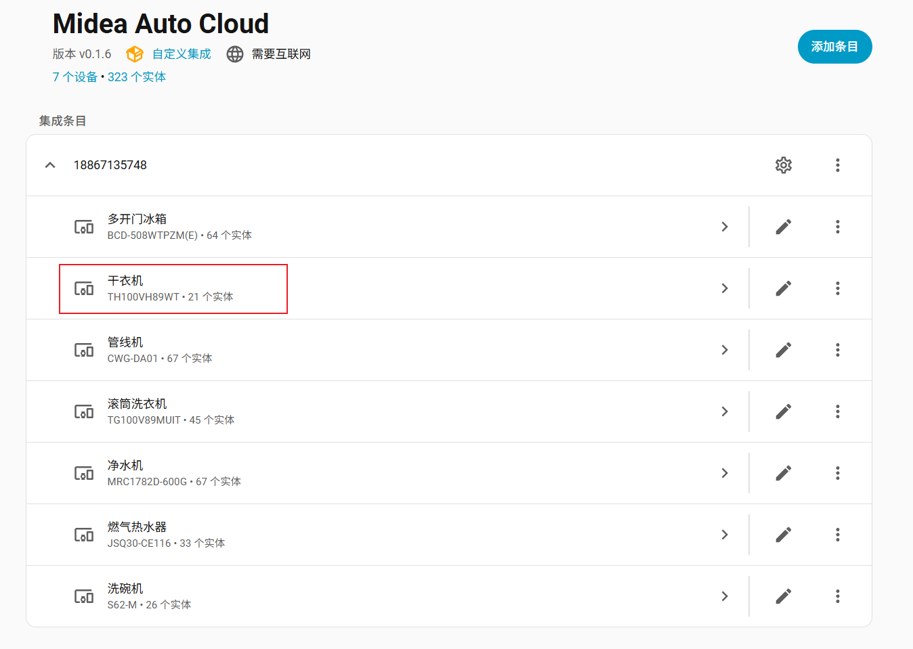
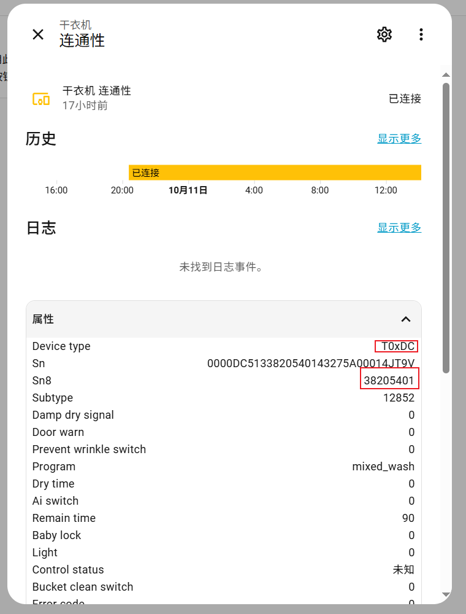

# 贡献指南

感谢您考虑为我们的项目做出贡献！您的努力将使我们的项目变得更好。

在您开始贡献之前，请花一点时间阅读以下准则：

## 我可以如何贡献？

### 报告问题

如果您在项目中遇到错误，请在 GitHub 上[报告问题](https://github.com/sususweet/midea_auto_cloud/issues/new/)，并提供关于错误的详细信息，包括复现步骤、 debug 级日志以及错误出现的时间。

集成开启 debug 级日志的[方法](https://www.home-assistant.io/integrations/logger/#log-filters)：

```
# configuration.yaml 设置打印日志等级

logger:
  default: critical
  logs:
    custom_components.xiaomi_home: debug
```

### 建议增强功能

如果您有增强或新功能的想法，欢迎您在 GitHub 讨论区[创建想法](https://github.com/sususweet/midea_auto_cloud/discussions/new?category=ideas) 。我们期待您的建议！

### 贡献代码

1. Fork 该仓库并从 `master` 创建您的分支。
2. 确保您的代码符合项目的编码规范。
3. 确保您的提交消息描述清晰。
4. 提交请求应附有明确的问题描述和解决方案。
5. 如果必要，请更新文档。
6. 请运行测试并确保测试通过。

## 适配设备

要适配本项目中暂未包含的设备，可以按照以下步骤进行：

1. 在Homeassistant中安装本插件，安装完成后登录自己的账号，可以看到自己名下的设备。

2. 在集成中找到需要适配的设备，点击设备的相关字段进入详情页面，如下图：



3. 点击传感器中的`连通性`，可以看到该设备可以被读取和访问的状态，如下图：  



着重关注Device type、Subtype这两个字段，这是后续获得设备控制对应lua文件的基础。

4. 进入Homeassistant的安装目录，在`.storage/midea_auto_cloud/lua/`目录下找到T_0000_`Device type`_`Subtype`_***.lua文件，例如上面干衣机设备的lua文件是： T_0000_DC_12852_2021121701.lua。

5. 可用人工分析或者AI分析的方法解析lua文件，结合美的官方APP的控制界面，提取出需要控制的设备属性，把修改合并到`device_mapping`中对应设备`Device type`的py文件中。

6. `device_mapping`中设备映射文件的编写方法可参考之前编写过的，`default`是默认的映射，可以作为参考，默认改这个就可以。如果自己设备的映射跟通用的差别太大（目前发现有空调、新风系统设备类型都是T0xAC，但可控制的变量差别比较大），可以根据设备的sn8来新建字段。

7. 完成上述步骤，编写好`device_mapping`中对应设备的py文件，即可在自己的机器上测试，测试好后就可以提pr。

## 拉取请求准则

在提交拉取请求之前，请确保满足以下要求：

- 您的拉取请求解决了单个问题或功能。
- 您已在本地测试过您的更改。
- 您的代码遵循项目的代码规范。
- 所有现有测试都通过，并且如果适用，您已添加了新的测试。
- 任何依赖更改都有文档说明。

## 代码规范

本项目的代码格式遵循 [Google Style](https://google.github.io/styleguide/pyguide.html) 。请确保您的贡献符合该指南。

## Commit Message 格式

```
<type>: <subject>
<BLANK LINE>
<body>
<BLANK LINE>
<footer>
```

type ：有以下几种变更类型

- feat：新增功能。
- fix：修复问题。
- docs：仅仅修改了文档。
- style：仅仅是对格式进行修改，如逗号、缩进、空格等，不改变代码逻辑。
- refactor：代码重构，没有新增功能或修复问题。
- perf：优化性能。
- test：增加或修改测试用例。
- chore：修改编译流程，或变更依赖库和工具等。
- revert：版本回滚。

subject ：简洁的标题，描述本次提交的概要。使用祈使句、现在时态，首字母小写，结尾不加句号。

body ：描述本次提交的详细内容，解释为什么需要这些变更。除 docs 之外的变更类型必须包含 body。

footer ：（可选）关联的 issue 或 pull request 编号。

## 命名规范

### 第三方平台命名规范

- 描述“Home Assistant”时必须使用“Home Assistant”，变量可以使用“hass”或“hass_xxx”。

### 其它命名规范

- 文档中的中文语句包含英文时，如果英文没有被中文引号括起来，那么中文与英文之间必须有一个空格。（最好代码注释也这么写）

## 许可

在为本项目做出贡献时，您同意您的贡献遵循本项目的[许可证](../LICENSE.md) 。

当您第一次提交拉取请求时，GitHub Action 会提示您签署贡献者许可协议（Contributor License Agreement，CLA）。只有签署了 CLA ，本项目才会合入您的拉取请求。

## 获取帮助

如果您需要帮助或有疑问，可在 GitHub 的[讨论区](https://github.com/sususweet/midea_auto_cloud/discussions/)询问。

您还可以联系 sususweetcandy@qq.com