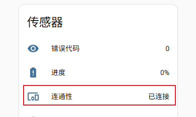
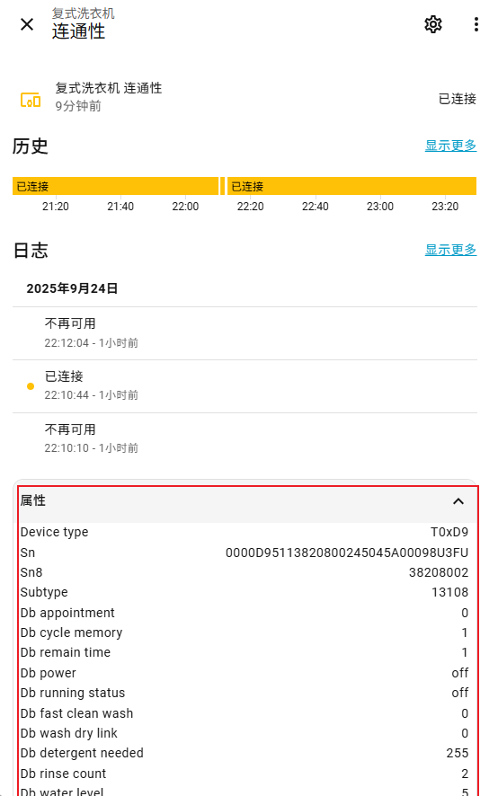

# Midea Auto Cloud

English | [简体中文](README_hans.md)

Get devices from MSmartHome/Midea Meiju homes through the network and control them via Midea's cloud API.

- Automatically discover and find devices
- Automatically download device protocol files
- Update device status to visible device attributes

## Version Notes

- All devices can generate a binary sensor named "Status" by default, which lists all accessible device attributes in its properties (some values are not settable)
- The first few items of the Status entity list the device classification information for reference

## Currently Supported Device Types

- T0x13 Electric Light
- T0x15 Water Heater
- T0x17 Laundry Machine
- T0x21 Central Air Conditioning Gateway
- T0x26 Bath Heater
- T0x3D Water Heater
- T0x9B Steam oven
- T0x9C Integrated Gas Stove
- T0xA1 Dehumidifier
- T0xAC Air Conditioner
- T0xB2 Electric Steamer
- T0xB3 Disinfection Cabinet
- T0xB6 Range Hood
- T0xB7 Gas Stove
- T0xB8 Smart Robot Vacuum
- T0xBC Air Sensor
- T0xBF Microwave Steam Oven
- T0xC1 Wall hanging furnace
- T0xC3 Heat Pump
- T0xCA French Door Refrigerator
- T0xCC Central Air Conditioning (Ducted) Wi-Fi Controller
- T0xCD Air Energy Water Heater
- T0xCE Fresh Air System
- T0xCF Central Air Conditioning Heating
- T0xD9 Twin Tub Washing Machine
- T0xDA Impeller Washing Machine
- T0xDB Cylinder Washing Machine
- T0xDC Clothes Dryer
- T0xE1 Dishwasher
- T0xE2 Electric Water Heater
- T0xE3 Constant Temperature Gas Water Heater
- T0xE6 Wall hanging furnace
- T0xEA Rice Cooker
- T0xED Water Softener
- T0xFA Electric Fan
- T0xFB Electric Heater
- T0xFC Air Purifier
- T0xFD Humidifier

Welcome to collaborate on adding support for more devices.

Collaboration method: After adding this plugin, find devices that are not correctly identified, click on `Connectivity` under the `Sensor` category of the corresponding device:

Expand the `Attributes` card below and submit these fields with the issue. Pay special attention to the `Device type` and `Subtype` fields, as these are the basis for obtaining the corresponding lua files for device control.

Then go to the Home Assistant installation directory, find the device's corresponding T_0000_`Device type`_`Subtype`_***.lua file in the `.storage/midea_auto_cloud/lua/` directory and `zip` file in the `.storage/midea_auto_cloud/plugin/` directory, and wait for adaptation.

## Entity Mapping

Mapping files are located under `device_mapping`, with one mapping file for each major category. Currently supported entity types for mapping are:
- sensor
- binary_sensor
- switch
- select
- climate
- fan
- water_heater

The example configuration `22012227` demonstrates how to map device attributes to various Home Assistant entities above.

## Acknowledgments

Thanks to the [midea-meiju-codec](https://github.com/MattedBroadSky/midea-meiju-codec) project for providing prior knowledge.
